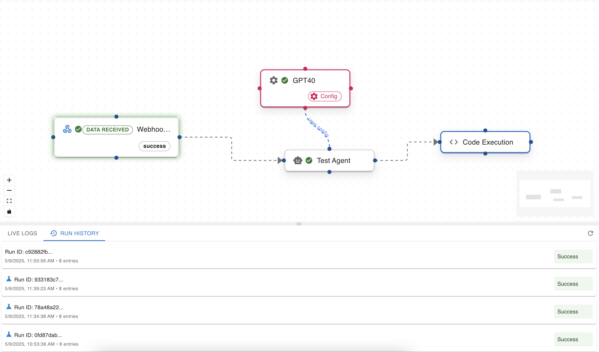
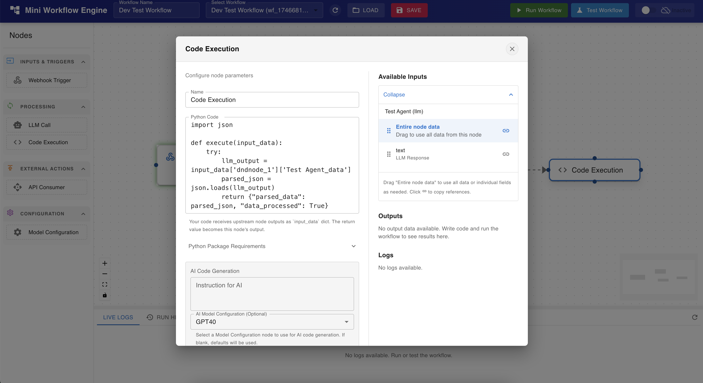
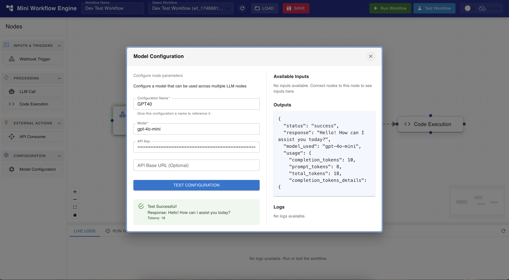
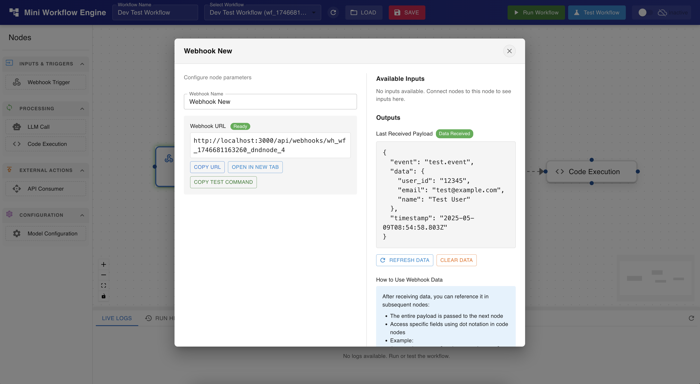
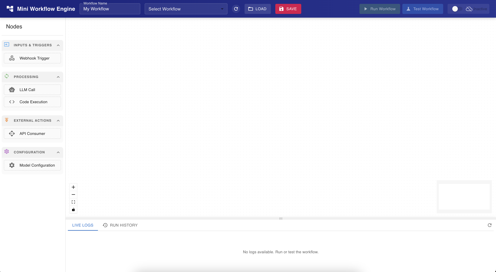

# Agents & Wrokflows, A Mini Workflow Engine: a super minimal n8n alternative!

**Unlock powerful automation for your business with the Mini Workflow Engine!** This intuitive, n8n-like tool empowers you to design, manage, and execute complex workflows through a stunning drag-and-drop visual editor. Say goodbye to tedious manual tasks and hello to streamlined efficiency.

Whether you're looking to integrate with LLMs, run custom Python scripts, connect to external APIs, or trigger workflows via webhooks, our engine provides the flexibility and power you need.

**Need help getting started or looking for custom modifications?** We offer professional setup and customization services to tailor the Mini Workflow Engine perfectly to your unique business requirements. Contact us to learn more!

## Key Features: Why Choose Mini Workflow Engine?

*   🚀 **Intuitive Visual Workflow Editor:** Effortlessly design, visualize, and manage your automation sequences with our user-friendly drag-and-drop interface. See your processes come to life!
*   🎣 **Versatile Webhook Triggers:** Kickstart your workflows automatically based on incoming HTTP requests from any service or application.
*   🧠 **Seamless LLM Integration:** Tap into the power of Large Language Models (e.g., OpenAI, Anthropic) directly within your workflows for advanced AI-driven tasks.
*   🐍 **Custom Python Code Execution:** Inject your own Python scripts to perform specialized tasks, giving you limitless control and flexibility.
*   🧩 **Flexible Generic Code Node:** Execute custom code snippets (details TBD, potentially including JavaScript) for even broader integration possibilities.
*   🔗 **Powerful API Consumer Node:** Connect to any external API, enabling you to send and receive data as part of your automated processes. This node also handles Webhook Actions seamlessly.
*   ⏳ **(Planned) Sophisticated Branching Logic:** Implement conditional paths and if/else conditions to create dynamic and intelligent workflows that adapt to different scenarios.
*   🔔 **(TBD) Messaging & System Integrations:** Future plans include direct integrations with popular services like Slack, WhatsApp, and more.

## Tech Stack

*   **Backend:** Python (FastAPI)
*   **Frontend:** React (Vite), React Flow
*   **Database:** (TBD - Likely SQLite or PostgreSQL for persistence)

## Screenshots

Here are some glimpses of the Mini Workflow Engine in action:

*   **Simple Workflow and Logs:**
    
*   **Code Execution Configuration:**
    
*   **Node Configuration:**
    
*   **Webhook Setup:**
    
*   **Workflow Editing:**
    

## Setup

Everything is setup and configured for docker

Simply `docker-compose up -d` to get started.

## Contributing

We welcome contributions! Please see `CONTRIBUTING.md` for details on how to contribute, submit bug reports, or request features.

## License

This project is licensed under the **MIT License** - see the `LICENSE` file for details.
